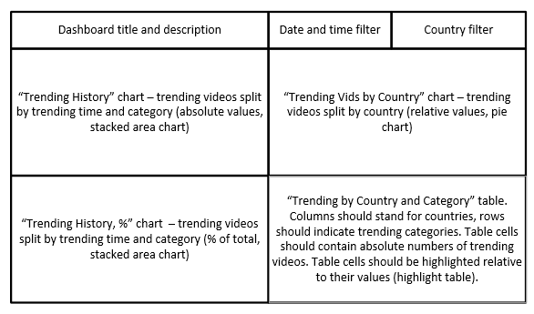

# Project Description.  
   This project is to analyze trending videos on YouTube to determine what content deserves marketing attention.
Each video has a specific category (Entertainment, Music, News & Politics, etc.), region, and trending date.
A video can be in the trending section for several days in a row.

# Business goal:  
Analyze trending-video history on YouTube  

How often the dashboard will be used: at least once a day  
Target dashboard user: video ads planning managers  
Dashboard data content:  
Trending videos from the past, broken down by day and category  
Trending videos, broken down by countries  
A table of correspondence between categories and countries  
Parameters according to which the data is to be grouped:  
Trending date and time   
Video category  
Country  
# The data:  
`Trending history `— absolute values with a breakdown by day (two graphs: absolute numbers and percentage ratio)  
Events, broken down by countries — relative values (% of events)  
The correspondence between the categories and countries — absolute values (a table)  
Importance: all graphs are equally important  
Data sources for the dashboard: the data engineers promised to create an aggregate table called trending_by_time. Here's its structure:  
`record_id` — primary key   
`region `— country/geographical region   
`trending_date` — date and time  
`category_title` — the video category  
`videos_count `— the number of videos in the trending section  

The table is stored in the data-analyst-youtube-data. database, which was created especially for your needs
Data update interval: once every 24 hours, at midnight UTC  

Graphs, dashboard controls, and their arrangement:  
</img>   

# Use your dashboard to answer the questions :   
Which video categories trended most often?  
How were they distributed among regions?   
What categories were especially popular in the United States? Were there any differences between the categories popular in the US and those popular elsewhere?
